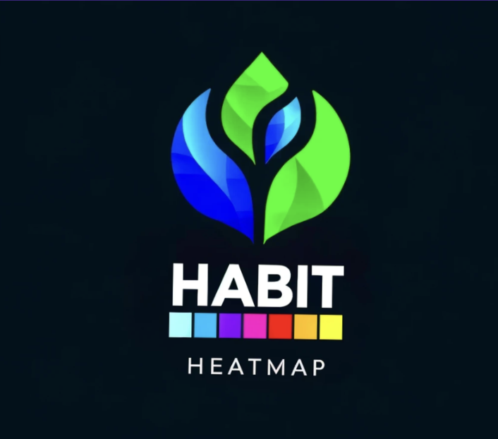

<a name="Habit Heatmap"></a>

<!-- PROJECT SHIELDS -->
<!--
*** I'm using markdown "reference style" links for readability.
*** Reference links are enclosed in brackets [ ] instead of parentheses ( ).
*** See the bottom of this document for the declaration of the reference variables
*** for contributors-url, forks-url, etc. This is an optional, concise syntax you may use.
*** https://www.markdownguide.org/basic-syntax/#reference-style-links
-->
[![Contributors][contributors-shield]][contributors-url]
[![Forks][forks-shield]][forks-url]
[![Stargazers][stars-shield]][stars-url]
[![MIT License][license-shield]][license-url]

<!-- PROJECT LOGO -->
<br />
<div align="center">
  <a href="https://github.com/IshmamF/habit-heatmap">
    
  </a>

<h3 align="center">Habit Heatmap</h3>

  <p align="center">
    A fun way to improve your lifestyle!
    <br />
    <a href="https://github.com/IshmamF/habit-heatmap"><strong>Explore the docs »</strong></a>
    <br />
    <br />
    <a href="https://github.com/IshmamF/habit-heatmap">View Demo</a>
    ·
    <a href="https://github.com/IshmamF/habit-heatmap/issues/new?labels=bug&template=bug-report---.md">Report Bug</a>
    ·
    <a href="https://github.com/IshmamF/habit-heatmap/issues/new?labels=enhancement&template=feature-request---.md">Request Feature</a>
  </p>
</div>

<!-- TABLE OF CONTENTS -->
| No. | Section | Subsection |
| --- | ------- | ---------- |
| 1 | [About The Project](#about-the-project) | [Built With](#built-with) |
| 2 | [Getting Started](#getting-started) | [Prerequisites](#prerequisites) |
|   |   | [Installation](#installation) |
| 3 | [Usage](#usage) |  |
| 4 | [Roadmap](#roadmap) |  |
| 5 | [Contributing](#contributing) |  |
| 6 | [License](#license) |  |
| 7 | [Contact](#contact) |  |
| 8 | [Acknowledgments](#acknowledgments) |  |

<!-- ABOUT THE PROJECT -->
## About The Project

![Product Name Screen Shot][product-screenshot]

Habit Heatmap is a web application that helps you track your habits and visualize your progress. It uses a heatmap to show you how well you are doing with your habits. The app is built with React, Tailwind, MongoDB, and Flask.

<p align="right">(<a href="#readme-top">back to top</a>)</p>

### Built With

* [![React][React.js]][React-url]
* [![Tailwind][Tailwind.com]][Tailwind-url]
* [![MongoDB][MongoDB.com]][MongoDB-url]
* ![Flask][Flask.com]

<p align="right">(<a href="#readme-top">back to top</a>)</p>

<!-- GETTING STARTED -->
## Getting Started

To get a local copy up and running follow these simple example steps.

### Prerequisites

1. Get a free API Key at [api ninjas](https://api-ninjas.com/profile)

2. Clone the repo

   ```sh
   git clone https://github.com/IshmamF/habit-heatmap.git
   ```

3. Install NPM packages

   ```sh
   npm install cal-heatmap
   ```

4. Enter your API in `config.js`

   ```js
   const API_KEY = 'ENTER YOUR API';
   ```

#### Frontend

1. Install Node.js
2. Navigate to the frontend directory
3. Run the following command to install the required packages

   ```sh
   npm install
   ```

4. Run the following command to start the development server

   ```sh
    npm start
    ```

#### Backend

1. Install Python
2. Run the following command to install the required packages

   ```sh
   pip install -r requirements.txt
   ```

3. Run the following command to start the development server

   ```sh
    python server/server.py
    ```

<p align="right">(<a href="#readme-top">back to top</a>)</p>

## CI/CD
  Backend: https://habit-heatmap-api-d98a01d08072.herokuapp.com/api/v1/ping <br>
  Deployed on Heroku, Go to [deploy-back github actions](https://github.com/IshmamF/habit-heatmap/blob/main/.github/workflows/deploy-back.yaml) <br>
  Frontend: https://habit-heatmap.vercel.app/ <br>
  Deployed on Vercel, Go to [deploy-back github actions](https://github.com/IshmamF/habit-heatmap/blob/main/.github/workflows/deploy-front.yaml)  <br>
  Vercel has automatic updates so adding CD to github actions isn't necessary for frontend. 
  
## Usage

Use this space to show useful examples of how a project can be used. Additional screenshots, code examples and demos work well in this space. You may also link to more resources.

_For more examples, please refer to the [Documentation](https://example.com)_

<p align="right">(<a href="#readme-top">back to top</a>)</p>

<!-- ROADMAP -->
## Roadmap

* [ ] Habit Metrics
* [ ] Accountability Partner
* [ ] Social Sharing
  * [ ] Allow users to share their progress on the app through posts and comments.

See the [open issues](https://github.com/IshmamF/habit-heatmap/issues) for a full list of proposed features (and known issues).

<p align="right">(<a href="#readme-top">back to top</a>)</p>

<!-- CONTRIBUTING -->
## Contributing

Contributions are what make the open source community such an amazing place to learn, inspire, and create. Any contributions you make are **greatly appreciated**.

If you have a suggestion that would make this better, please fork the repo and create a pull request. You can also simply open an issue with the tag "enhancement".
Don't forget to give the project a star! Thanks again!

1. Fork the Project
2. Create your Feature Branch (`git checkout -b feature/AmazingFeature`)
3. Commit your Changes (`git commit -m 'Add some AmazingFeature'`)
4. Push to the Branch (`git push origin feature/AmazingFeature`)
5. Open a Pull Request

<p align="right">(<a href="#readme-top">back to top</a>)</p>

<!-- LICENSE -->
## License

Distributed under the MIT License. See [LICENSE](LICENSE) for more information.

<p align="right">(<a href="#readme-top">back to top</a>)</p>

<!-- CONTACT -->
## Contact

* <abrarhabib285@gmail.com>
* <ishmamf2003@gmail.com>
* <penayared16@gmail.com>

## Project Link

[https://github.com/IshmamF/habit-heatmap](https://github.com/IshmamF/habit-heatmap)

<p align="right">(<a href="#readme-top">back to top</a>)</p>

<!-- ACKNOWLEDGMENTS -->
## Acknowledgments

* [Ishmam Fardin](https://github.com/IshmamF)
* [Yared Pena](https://github.com/YaredPena)
* [Abrar Habib](https://github.com/dddictionary)

<p align="right">(<a href="#readme-top">back to top</a>)</p>

## Notes
<!-- MARKDOWN LINKS & IMAGES -->
<!-- https://www.markdownguide.org/basic-syntax/#reference-style-links -->
[contributors-shield]: https://img.shields.io/github/contributors/IshmamF/habit-heatmap.svg?style=for-the-badge
[contributors-url]: https://github.com/IshmamF/habit-heatmap/graphs/contributors
[forks-shield]: https://img.shields.io/github/forks/IshmamF/habit-heatmap.svg?style=for-the-badge
[forks-url]: https://github.com/IshmamF/habit-heatmapnetwork/members
[stars-shield]: https://img.shields.io/github/stars/IshmamF/habit-heatmap.svg?style=for-the-badge
[stars-url]: https://github.com/IshmamF/habit-heatmap/stargazers
[license-shield]: https://img.shields.io/github/license/IshmamF/habit-heatmap.svg?style=for-the-badge
[license-url]: https://github.com/IshmamF/habit-heatmap/blob/main/LICENSE.txt
[product-screenshot]: images/frontend.png
[React.js]: https://img.shields.io/badge/React-20232A?style=for-the-badge&logo=react&logoColor=61DAFB
[React-url]: https://reactjs.org/
[Flask.com]: https://img.shields.io/badge/Flask-000000?style=for-the-badge&logo=flask&logoColor=white
[Tailwind.com]: https://img.shields.io/badge/Tailwind_CSS-38B2AC?style=for-the-badge&logo=tailwind-css&logoColor=white
[Tailwind-url]: https://tailwindcss.com/
[MongoDB.com]: https://img.shields.io/badge/MongoDB-4EA94B?style=for-the-badge&logo=mongodb&logoColor=white
[MongoDB-url]: https://www.mongodb.com/
